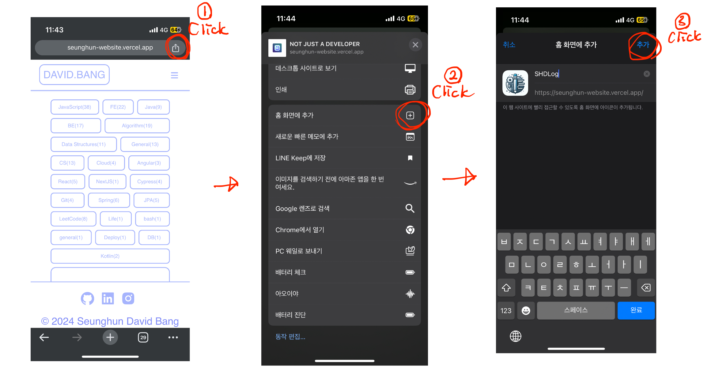

### Progressive Web Application Used NextJS & Typescript

Nowaday we bring our mobile phone whenever you are, wherever you are.

My idea is to have a simple application which can help you study all the times easily via mobile phone.

#### Download this app as PWA 

Come here to Download the template!

First, you need to do is to visit this website.

[page link](https://seunghun-website.vercel.app)

Second, what you need is just 3 clicks!

1. 1.Click Share btn on your chrome/safari browser (Example is in Chrome)
2. 2.Click the `Add to Home` btn 
3. 3.Click `Add`

#### What is PWA ?

PWA stands for `Progressive Web Application`. It's a type of web application that uses modern web capabilities to deliver an app-like experience to users. 

These applications can be loaded like regular web pages, but offer functionalities such as working offline, push notifications, and device hardware access traditionally available only to native mobile applications. 

PWAs are an emerging technology that combine the open standards of the web offered by modern browsers to provide benefits of a rich mobile experience.
